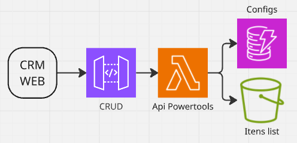
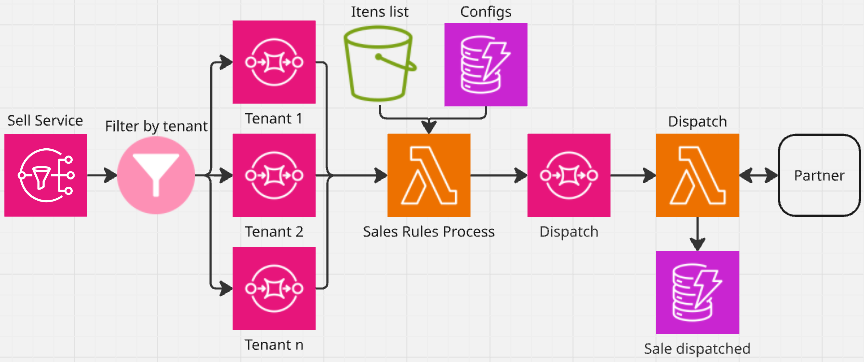
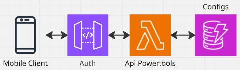
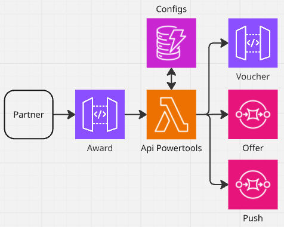
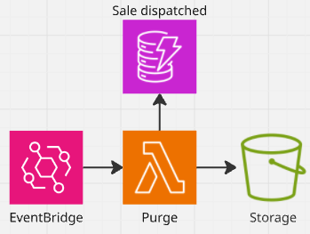
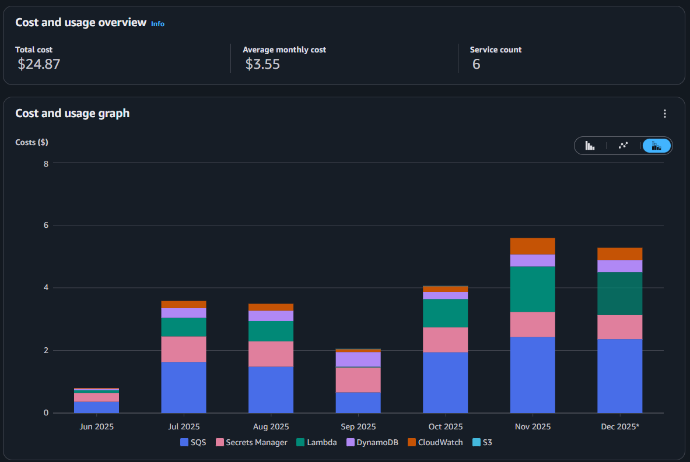

# Dynamic Campaign Platform

## Overview

The **Dynamic Campaign Platform** is a modular, multi-tenant campaign processing system that enables marketing and CRM teams to configure and operate dynamic promotional campaigns without requiring engineering intervention.

The platform processes purchase events, applies complex campaign rules, integrates with external partners for reward processing, and orchestrates notification workflows — all using a fully **serverless, event-driven architecture** on AWS.

It was designed to handle high transactional volume with strong observability, operational safety, and exceptional cost efficiency.

---

## Role & Duration

- **Role:** Cloud Developer / Specialist  
- **Duration:** 2 months (June-July)  

---

## Business Context

The business required the ability to run **dynamic promotional campaigns** for mobile application users, segmented by brand and campaign type (e.g. Christmas, Carnival, anniversary, etc.).

Marketing and CRM teams needed autonomy to configure campaigns, define eligibility rules, integrate with external reward partners, and notify customers — without relying on development teams for manual configuration or code changes.

---

## Problem Statement

The legacy campaign process suffered from multiple operational limitations:

- Campaigns required manual engineering effort for setup and changes
- Limited observability and lack of test environments
- Silent failures that were difficult to detect and troubleshoot
- Tight coupling between business logic and deployment cycles

The business needed a platform that could safely process high volumes of purchases while allowing rapid campaign iteration and partner integration.

---

## Goals & Requirements

The platform was designed to:

- Enable **self-service campaign configuration** by CRM and marketing teams
- Support **multi-tenant** campaigns
- Process high volumes of purchase events during commercial hours
- Apply complex campaign rules dynamically
- Integrate with external reward and campaign partners
- Provide full observability and safe retry mechanisms
- Maintain extremely low operational cost

---

## High-Level Architecture

The system follows a **serverless, event-driven architecture**, with clear separation between campaign management, purchase processing, and partner interaction.

Core principles:
- Asynchronous processing using **Amazon SQS**
- Stateless compute using **AWS Lambda**
- Configuration-driven business rules
- Tenant isolation via event routing
- Built-in retries and DLQs for fault tolerance

### Technology Stack

- **Ingress:** Amazon API Gateway, Amazon SQS  
- **Compute:** AWS Lambda (AWS Lambda Powertools)  
- **Messaging:** Amazon SQS (with DLQs)  
- **Datastores:**  
  - Amazon DynamoDB (campaign configuration & audit records)  
  - Amazon S3 (long-term audit storage in compressed Parquet format)  
- **Observability:** Amazon CloudWatch  

---

## Architecture Overview

### Campaign Configuration (CRM)

CRM users configure campaigns through a management portal, defining campaign rules, eligibility criteria, partner endpoints, and notification behavior.

---

### Purchase Processing Flow

Purchase events are routed by tenant and processed asynchronously. Campaign rules are applied dynamically based on stored configuration.

---

### Customer Authentication Flow

The mobile application authenticates customers to generate secure, partner-specific access URLs for campaign participation.

---

### Reward & Partner Integration Flow

In this flow, the platform **receives reward decisions from external partners**, indicating that a given customer has been awarded a specific benefit (e.g. voucher value or special offer) and communication about.

---

### Data Retention & Purge Flow

Campaign data is archived after completion and removed from DynamoDB, ensuring both auditability and cost control.

---

## Core Domain Logic

### Campaign Configuration

Marketing configures campaigns via CRM with parameters such as:
- Campaign validity period
- Minimum purchase value
- Valid purchase type (in-store, e-commerce, or both)
- Blacklisted items (excluded from calculation)
- Whitelisted items (counted with bonus value)
- Partner endpoints for sale submission
- Authentication endpoints for customer participation
- Reward types (voucher values, special offers)
- Campaign-related push notifications

All rules are stored centrally and evaluated dynamically at runtime.

---

### Purchase Processing

1. Sales events are received via SQS
2. Events are routed by tenant
3. Campaign configuration is loaded from DynamoDB
4. Purchase value is recalculated based on rule sets
5. Ineligible purchases are discarded
6. Eligible purchases are dispatched to partner APIs
7. Successful dispatches are persisted for audit purposes
8. Failures are retried automatically via SQS DLQs

---

## External Integrations

- CRM platforms
- External campaign and reward partners
- Mobile application clients
- Voucher and offer providers

---

## Data & Persistence Strategy

- **DynamoDB:**  
  - Campaign configuration  
  - Partner dispatch records  
  - Audit and traceability  

- **Amazon S3:**  
  - Archived campaign data  
  - Compressed Parquet files for long-term audit and validation  

This strategy balances fast transactional access with cost-efficient long-term storage.

---

## Scalability & Load Characteristics

- **Average volume:** ~150k purchases per month
- Traffic concentrated during commercial hours
- Tenant-based event routing enables horizontal scalability
- Serverless compute ensures automatic scale-out without pre-provisioning

---

## Cost Efficiency & FinOps

The platform operates with an extremely low and predictable cost profile.

- **Average monthly cost:** ~USD 3.50
- **Peak monthly cost:** ~USD 5
- Fully serverless with no idle infrastructure

Below is the real AWS Cost Explorer report for the production environment:

---

## Key Technical Decisions & Trade-offs

- **Serverless-first architecture:**  
  Eliminated idle resources and aligned costs with real usage.

- **Configuration-driven business rules:**  
  Enabled campaign changes without redeployments, at the cost of increased validation complexity.

- **SQS-based orchestration:**  
  Improved reliability and backpressure handling while introducing eventual consistency.

- **Tenant-based event routing:**  
  Simplified isolation and scalability while increasing routing logic complexity.

- **Data archiving strategy:**  
  Reduced DynamoDB storage costs while preserving auditability.

---

## Observability & Reliability

- Centralized structured logging
- CloudWatch dashboards monitoring:
  - Event throughput
  - Processing failures
  - DLQ depth
- Alarms for:
  - Dispatch failures
  - Message backlog
  - Partner integration issues

---

## Results & Impact

- Full autonomy for marketing and CRM teams
- Elimination of manual campaign configuration by engineering
- High operational reliability and traceability
- Extremely low infrastructure cost
- Modular foundation for future campaign and reward expansion

---

## Disclaimer

All details presented here are anonymized and represent a sanitized version of a real enterprise system.  
No proprietary data, identifiers, or internal configurations are disclosed.
