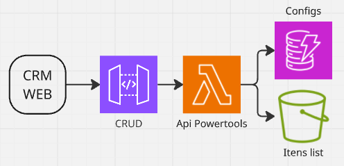
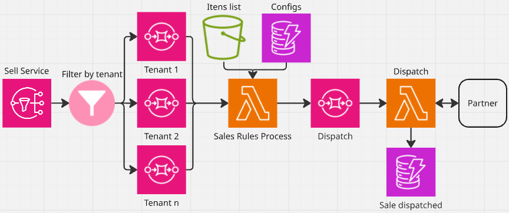
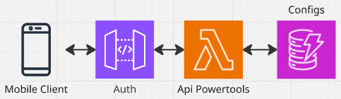
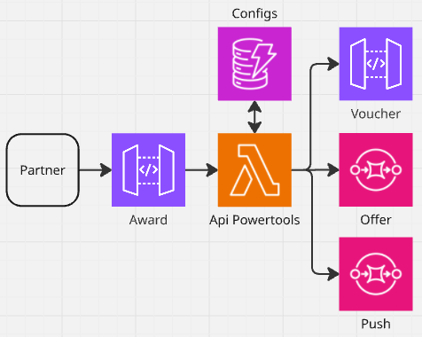
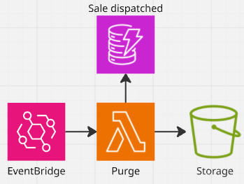
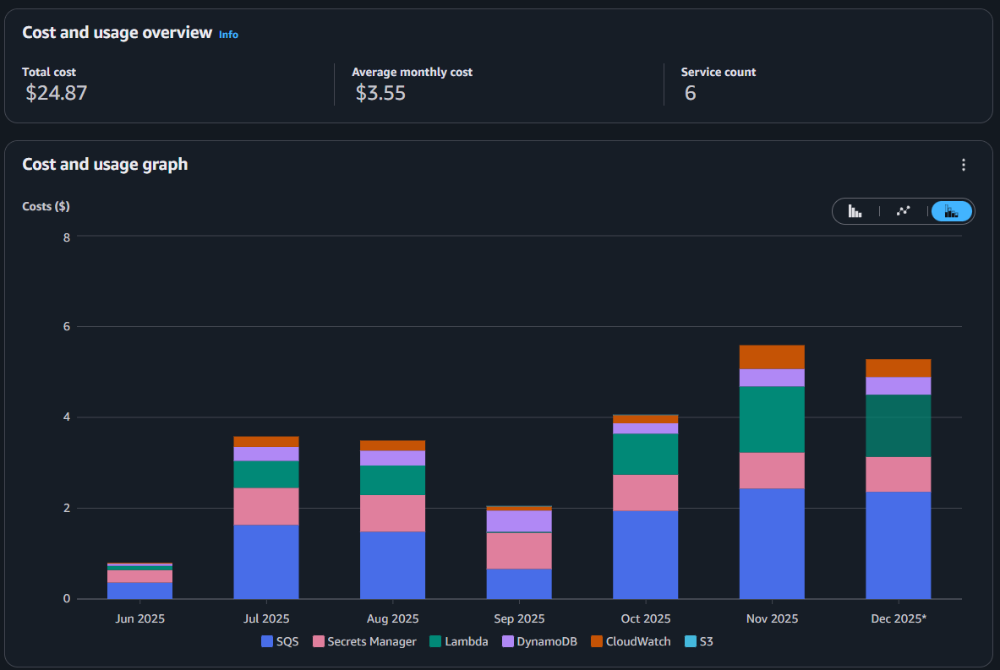

# Dynamic Campaign Platform

> Serverless, event-driven campaign processing platform on AWS — enabling marketing autonomy, partner integrations, and reward workflows at scale.

---

## Overview

The **Dynamic Campaign Platform** is a modular, multi-tenant system that enables marketing and CRM teams to configure and operate dynamic promotional campaigns **without requiring engineering intervention**.

The platform was designed after identifying that the legacy campaign process relied heavily on manual engineering effort for every campaign change — creating bottlenecks, silent failures, and limited observability. After investigating the root cause, I redesigned the entire platform using a serverless, event-driven architecture on AWS.

The new platform processes purchase events, applies complex campaign rules dynamically, integrates with external reward partners, and orchestrates notification workflows — all with exceptional cost efficiency and full observability.

---

## Role & Duration

| Field | Detail |
|---|---|
| **Role** | Cloud Developer / Specialist |
| **Duration** | 2 months (June – July) |

---

## Results & Impact

| Metric | Value |
|---|---|
| Average monthly infrastructure cost | ~$3.50 |
| Peak monthly infrastructure cost | ~$5.00 |
| Average purchase volume | ~150k purchases/month |
| Engineering involvement for campaign changes | Zero |
| Observability coverage | End-to-end structured logging + CloudWatch dashboards |

- Eliminated manual engineering effort for campaign configuration and changes
- Gave full autonomy to marketing and CRM teams for campaign lifecycle management
- Achieved near-zero infrastructure cost with fully serverless, on-demand compute
- Delivered reliable partner integrations with built-in retry and fault tolerance
- Established full operational observability with dashboards, alarms, and audit trails

---

## Problem Statement

The legacy campaign process suffered from critical operational limitations:

- Campaign setup and changes required direct engineering involvement
- No test environments — changes went straight to production
- Silent failures with no structured logging or alerting
- Tight coupling between business logic and deployment cycles
- Limited ability to scale during peak commercial periods

The business needed a platform that could process high volumes of purchases safely while giving marketing teams the autonomy to configure and iterate campaigns independently.

---

## High-Level Architecture

The system follows a **serverless, event-driven architecture** with clear separation between campaign management, purchase processing, and partner interaction.

**Core principles:**
- Asynchronous processing via **Amazon SQS**
- Stateless compute via **AWS Lambda**
- Configuration-driven business rules — no redeployment for campaign changes
- Tenant isolation via event routing
- Built-in retries and DLQs for fault tolerance

### Technology Stack

| Layer | Services |
|---|---|
| **Ingress** | Amazon API Gateway, Amazon SQS |
| **Compute** | AWS Lambda + Lambda Powertools |
| **Messaging** | Amazon SQS with DLQs |
| **Datastores** | Amazon DynamoDB, Amazon S3 (Parquet) |
| **Observability** | Amazon CloudWatch |

---

## Architecture Flows

### 1. Campaign Configuration (CRM)

CRM users configure campaigns through a management portal, defining:
- Campaign validity period and eligibility rules
- Minimum purchase value and valid purchase types (in-store, e-commerce, or both)
- Blacklisted and whitelisted items (with bonus value multipliers)
- Partner endpoints for sale submission and customer authentication
- Reward types (voucher values, special offers)
- Campaign-related push notification templates

All rules are stored in DynamoDB and evaluated dynamically at runtime — no code changes required.

---

### 2. Purchase Processing Flow

Purchase events are routed by tenant and processed asynchronously through the pipeline:

1. Sales events received via SQS
2. Events routed by tenant
3. Campaign configuration loaded from DynamoDB
4. Purchase value recalculated based on rule sets
5. Ineligible purchases discarded
6. Eligible purchases dispatched to partner APIs
7. Successful dispatches persisted for audit
8. Failures retried automatically via SQS DLQs

---

### 3. Customer Authentication Flow

The mobile application authenticates customers to generate secure, partner-specific access URLs for campaign participation.

---

### 4. Reward & Partner Integration Flow

The platform receives reward decisions from external partners, indicating that a customer has been awarded a specific benefit (voucher value or special offer), and orchestrates the downstream notification workflow.

---

### 5. Data Retention & Purge Flow

Campaign data is archived to S3 in compressed Parquet format after completion and removed from DynamoDB — ensuring auditability at minimal storage cost.

---

## Key Technical Decisions & Trade-offs

| Decision | Rationale | Trade-off |
|---|---|---|
| **Serverless-first** | Eliminates idle resources, aligns cost with real usage | Cold start latency on low-traffic periods |
| **Configuration-driven rules** | Campaign changes without redeployments | Increased validation complexity |
| **SQS-based orchestration** | Reliability, backpressure, and fault tolerance | Eventual consistency between stages |
| **Tenant-based event routing** | Clean isolation and horizontal scalability | Additional routing logic complexity |
| **S3 Parquet archiving** | Low-cost long-term storage with auditability | Requires ETL for direct querying |

---

## Data & Persistence Strategy

- **DynamoDB** — Campaign configuration, partner dispatch records, audit and traceability (hot data)
- **Amazon S3 (Parquet)** — Archived campaign data for long-term audit and validation (cold data)

This hybrid strategy balances fast transactional access with cost-efficient long-term storage.

---

## Scalability & Load Characteristics

- ~150k purchases processed per month
- Traffic concentrated during commercial hours
- Tenant-based routing enables horizontal scalability without architectural changes
- Serverless compute scales automatically — no pre-provisioning required

---

## Cost Efficiency & FinOps

The platform operates with an extremely low and fully predictable cost profile:

| Period | Cost |
|---|---|
| Average monthly | ~$3.50 |
| Peak monthly | ~$5.00 |

Fully serverless — zero idle infrastructure cost.

---

## Observability & Reliability

- Centralized structured logging across all Lambda functions
- CloudWatch dashboards monitoring event throughput, processing failures, and DLQ depth
- Alarms configured for dispatch failures, message backlog, and partner integration issues
- End-to-end traceability from purchase ingestion to reward delivery

---

## External Integrations

- CRM platforms (campaign configuration portal)
- External campaign and reward partners (voucher and offer providers)
- Mobile application clients (customer authentication and participation)

---

## Disclaimer

All details presented here are anonymized and represent a sanitized version of a real enterprise system. No proprietary data, identifiers, or internal configurations are disclosed.
